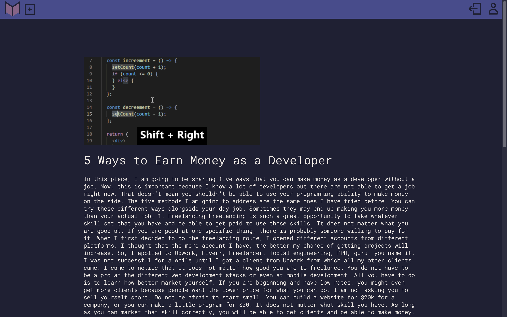

# [Median](https://median-article-app.herokuapp.com/)
   - ***A clone of the user driven publishing platform Medium***
​
    Median is app that recreates the feel and basic functionality of Medium, which has been a staple in the online
​
    publishing platform for almost ten years.
​
    Median allows its users/creators to write, edit, and post their own stories, with delete functionality implemented in the backend and soon the frontend.
​
    Median allows its users/creatora to read other users stories. There is also front-end and schema implementation of follow and like features. Bookmarking stories is a goal functionality as well, and is implemented in the schema.
​
​
#  Resources Used
  - **Javascript**
  - **Express**
  - **NODE**
  - **Sequelize**
  - **Cascading Style Sheets(CSS)**
  - **PUG Templating**
​
# In Development features
- **Use of a third party api**
- **Social media integration**
- **More dynamic creation/editing tools**
- **Bookmarking**
- **Like functionality**
- **Comment functionality**
- **Button-click delete**

​# Instructions
### Git Repo
- Clone git repo from https://github.com/jxnprince/Median.git
### Installation
 -install node.js version 12.18.4
 -create .env file in the Median directory with the below information from the .env.example file
 -DB_USERNAME=median_app
 -DB_PASSWORD=password
 -DB_DATABASE=median_development
 -DB_HOST=localhost
 -SESSION_SECRET=superSecretSecret
 -run npm install to install dependencies
 -npm install faker
 -run npx dotenv sequelize-cli db:create  to mount database
 -npx dotenv sequelize-cli db:migrate to migrate database
 -npx dotenv sequelize-cli db:seed:all to seed database
 -run npm start
 -load http://localhost:8080/ into your browsers

# Routes
​
## Users Routes
### `users/`
   - **GET**
      - *if user **is** logged in*
         - Redirects to users' Median feed
         
      - *if user **is not** logged in*
         - Displays splash page form with login/register
         - Has a "login as demo user" button
            - Demo user auto populates the form with Demo user information and makes the post to '/login' with demo user credentials
        
   - **POST** - Create a new user
​
### `users/signup`
   - **GET** - Loads signup form
   
​
### `users/login`
   - **POST** - Submits login form, doesn't render to the front end
### `users/logout`
   - **POST** - Deletes req.session.auth token, logging the current user out
      - They are then redirected to 'users/'
​
### `users/profile/:id`
   - **GET** - -Displays profile page for specified user.
      - Profile page uses API routes to dynamically display:
         - Followed users
         - Logged in user's stories
         - Maybe bookmarks :question:
        
   - **PUT** - Header will dynamically change to let the user CRUD all aspects of their account
   - **DELETE** - Allows user to delete account
​
## Story Routes
​
### `stories/submit-story`
   - **GET** - Displays a form to submit a new story
      - Activated through a button that persists across every page in the header
        
​
## API Routes
​
### `api/stories/`
   - **GET** - Return a list of the most recent stories
    
   - **POST** - Submits story via a form
   - Story will then populate the feed

### `api/stories/:id`
   - **GET** - Return a list of the most recent stories from a user
   - **DELETE** - Deletes a specific user story
      - User must own story to perform this operation, or see the delete button as an option at all
   - **PUT** - Updates a specific user story
      - User must own story to perform this operation, or see the edit button as an option at all
      - Uses the `stories/submit-story/` form template and auto-populates the form with the previously filled out information
​
### `api/users/:id/stories`
   - **GET** - Returns `5` stories
      - Includes:
         - Link to story
         - Quantity of likes
         - Comments
      - Organized by current date and then likes
​
### `api/follows`
   - **POST** - Creates a new follow
      - Adds targeted user to current user's followed list
      - Manifests as a button next to each username wherever they appear
​
### `api/likes`
   - **POST** - Creates a new "like"
      - Associated with the selected story and logged in user.
### `api/likes/:id`
   - **DELETE** - Removes the specified "like"
​
### `api/comments`
   - **GET** - Returns a list of comments
      - `api/comments?storyId=<storyId>` will return comments for a specific story
   - **POST** - Creates a comment
      - Comments cannot be edited or deleted, so think about what you say before you say it.
### `api/comments/:id`
   - **PUT** - Edit a comment
   - **DELETE** - Delete a comment